Welcome to Tongzhou Yoga International.

# Type of Yoga Available
- Hatha
- Bikram / Hot Yoga
- Ashtanga Yoga
- Flying Yoga

# Image Gallery
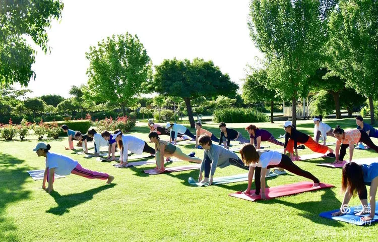{.lightbox group="my-gallery"}
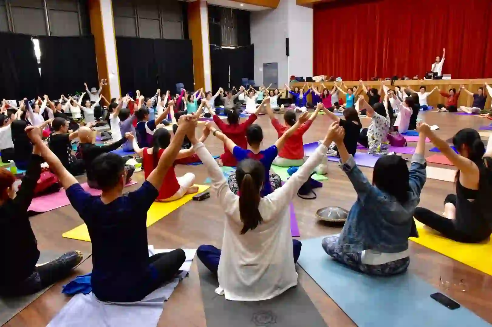{.lightbox group="my-gallery"}
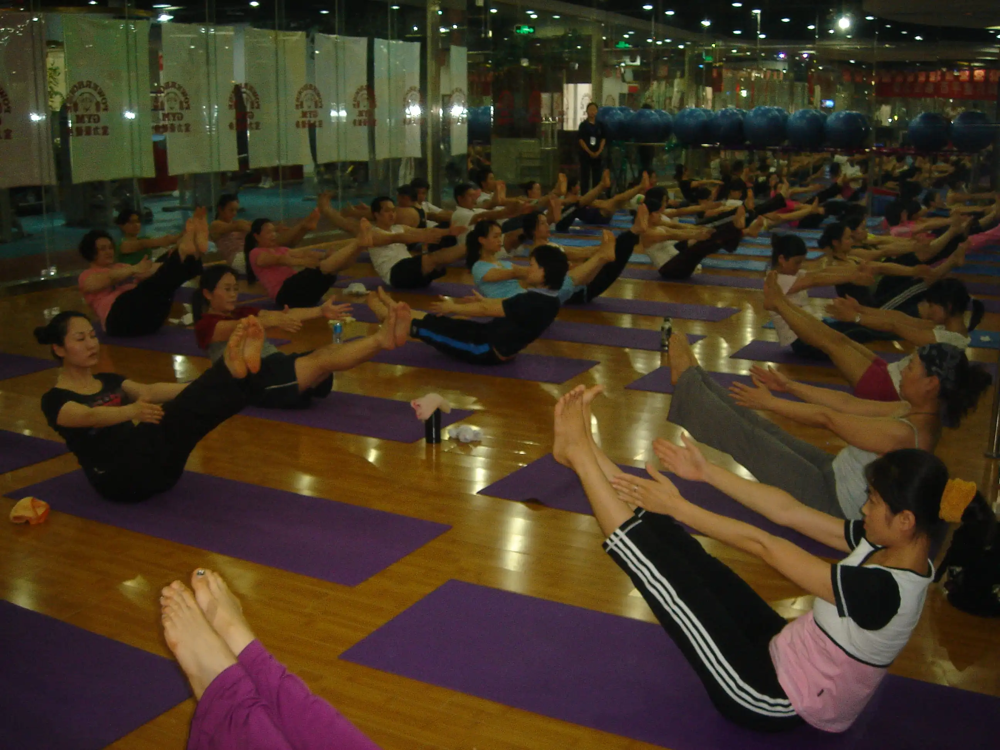{.lightbox group="my-gallery"}
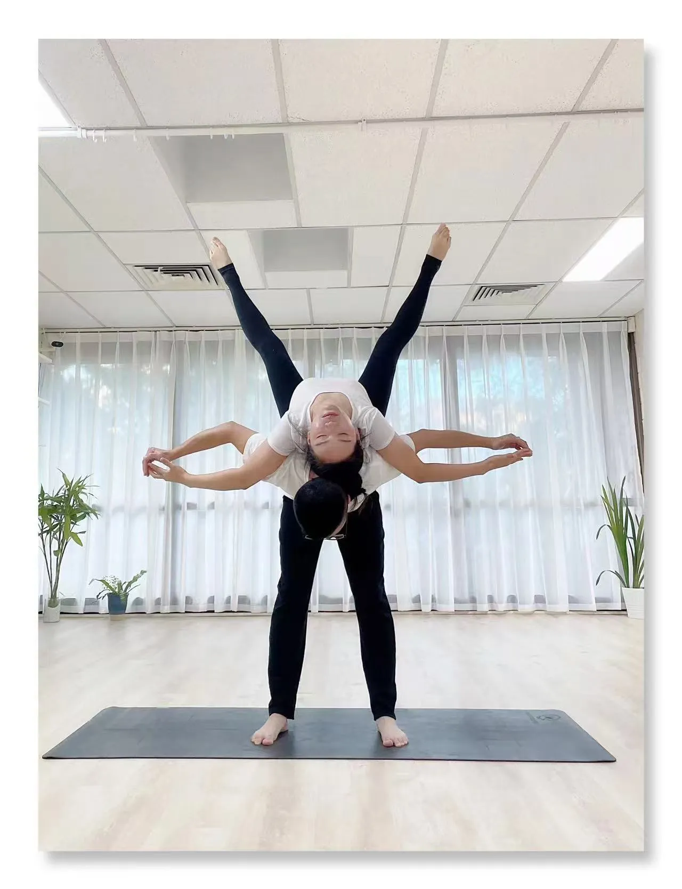{.lightbox group="my-gallery"}
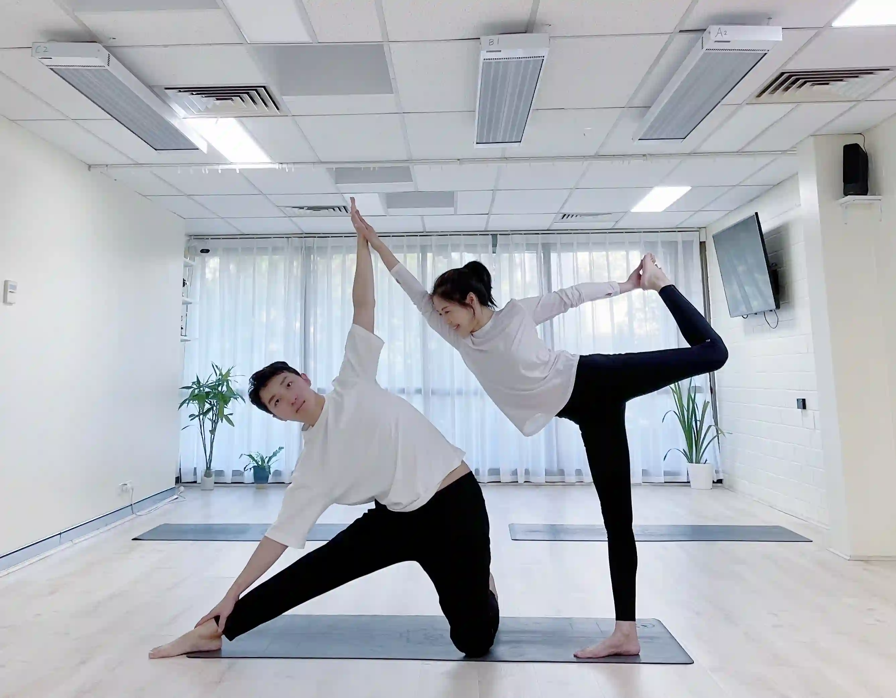{.lightbox group="my-gallery"}
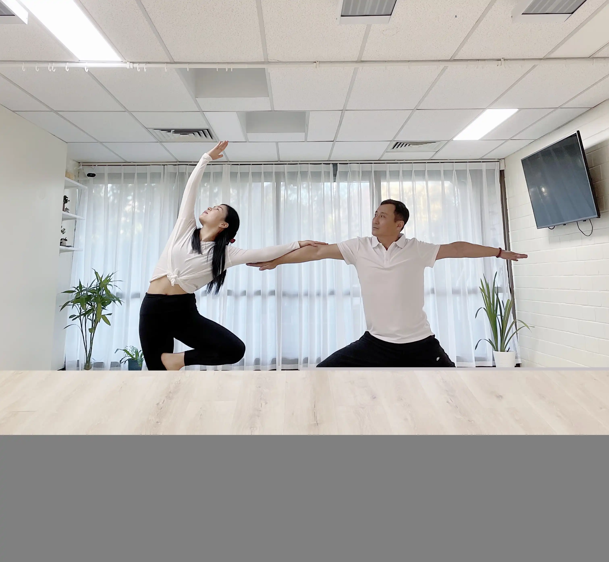{.lightbox group="my-gallery"}
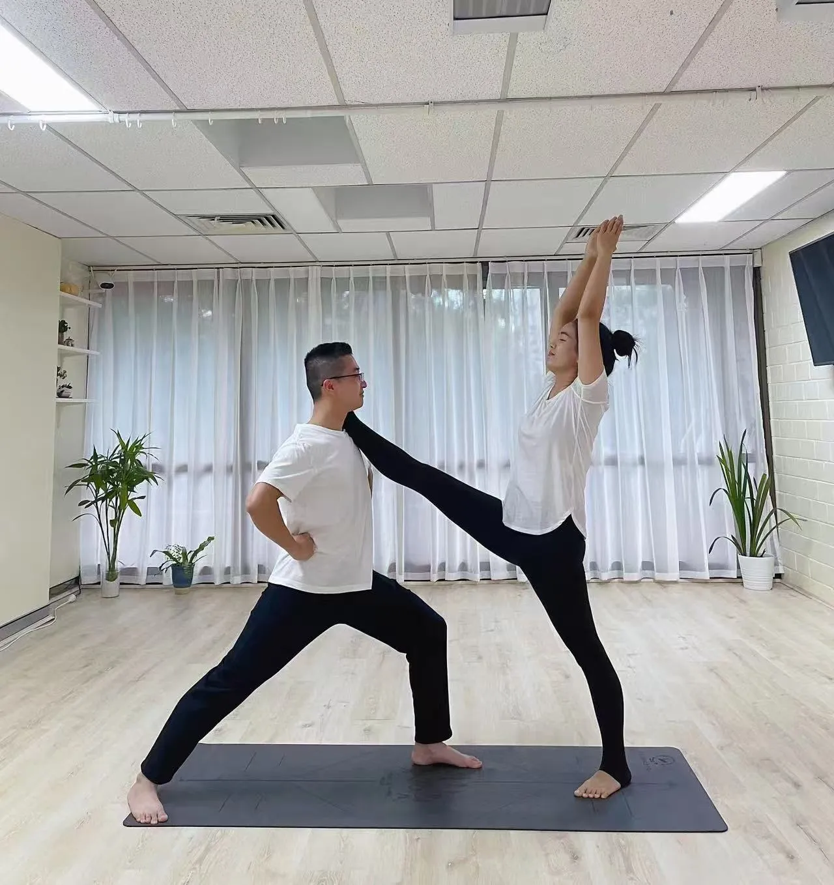{.lightbox group="my-gallery"}
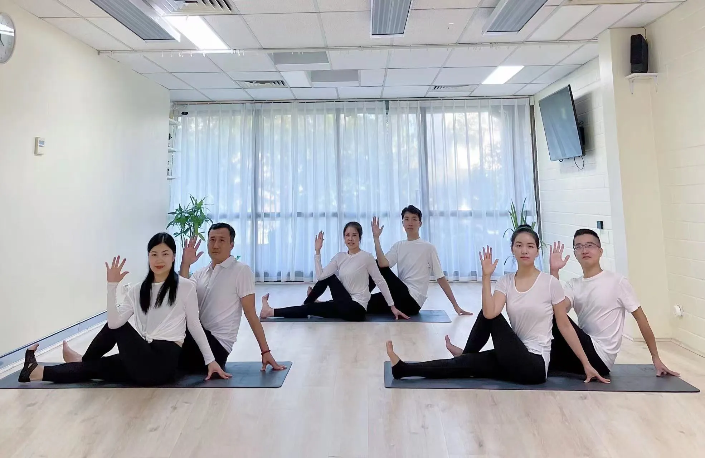{.lightbox group="my-gallery"}
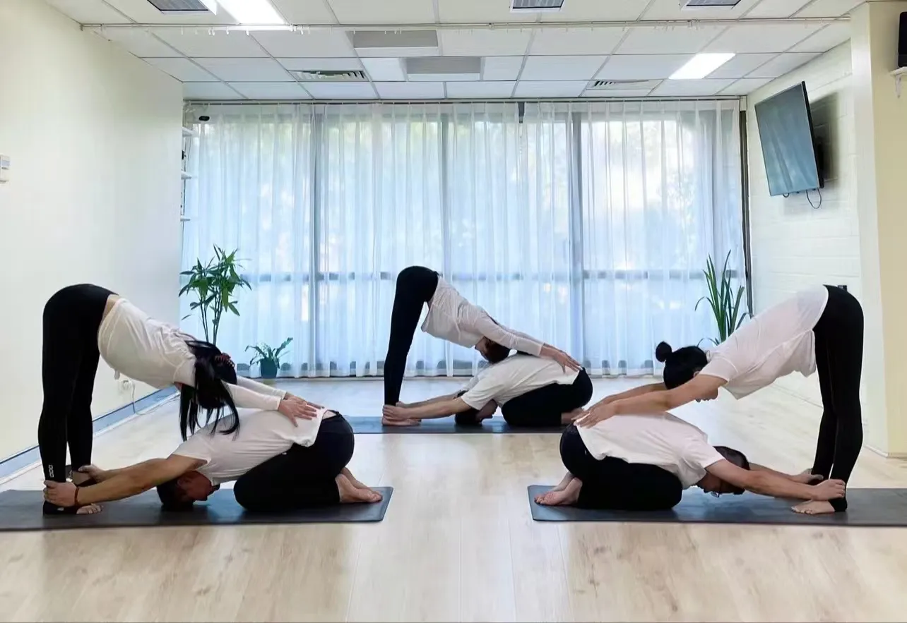{.lightbox group="my-gallery"}
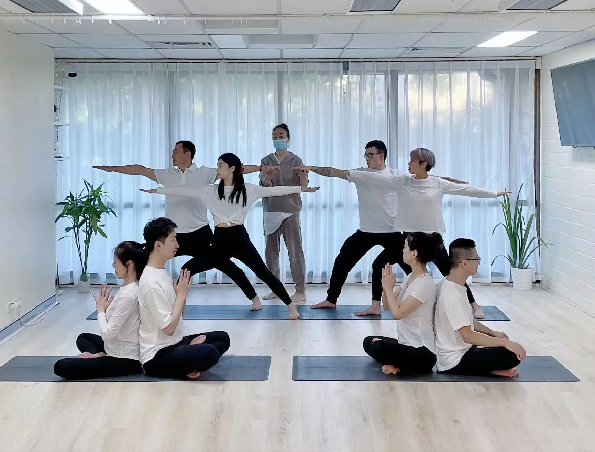{.lightbox group="my-gallery"}
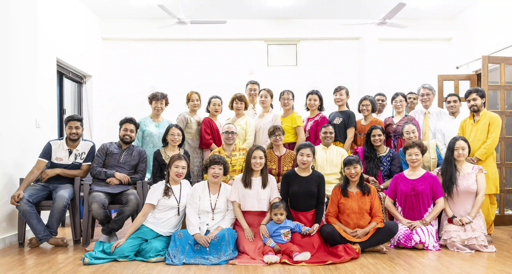{.lightbox group="my-gallery"}
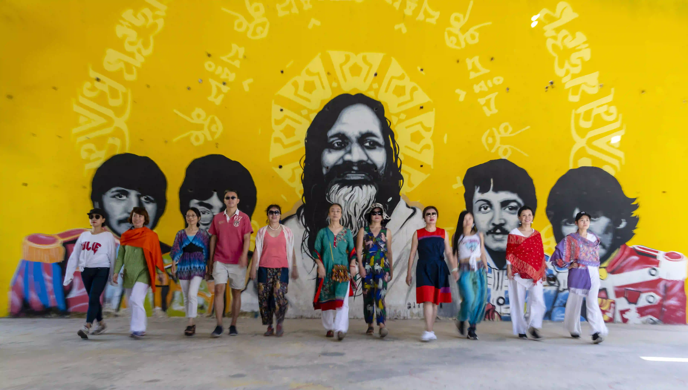{.lightbox group="my-gallery"}

# Locations

- [Burwood](locations/burwood.html)
- [Chatswood](locations/chatswood.html)
- [Eastwood](locations/eastwood.html)
- Hurstville: 1/303 Forest Road, Hurstville
- Rhodes **Coming soon!**

<iframe src="https://www.google.com/maps/d/u/0/embed?mid=1IHHxT-4T7I-iD60S2mXVg_P1pQ998yc&ehbc=2E312F&noprof=1" width="640" height="480"></iframe>

# Timetable

# Information

# Testimonies

